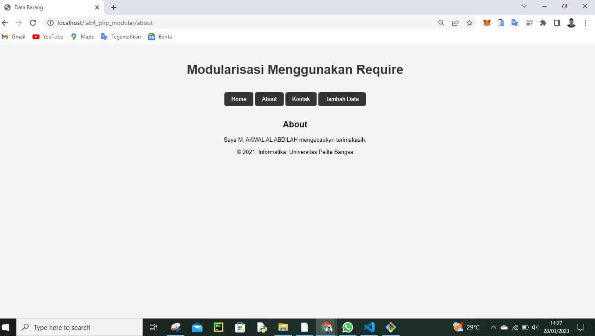
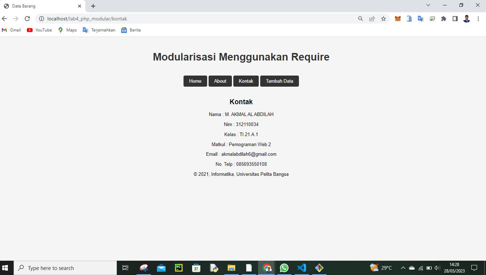
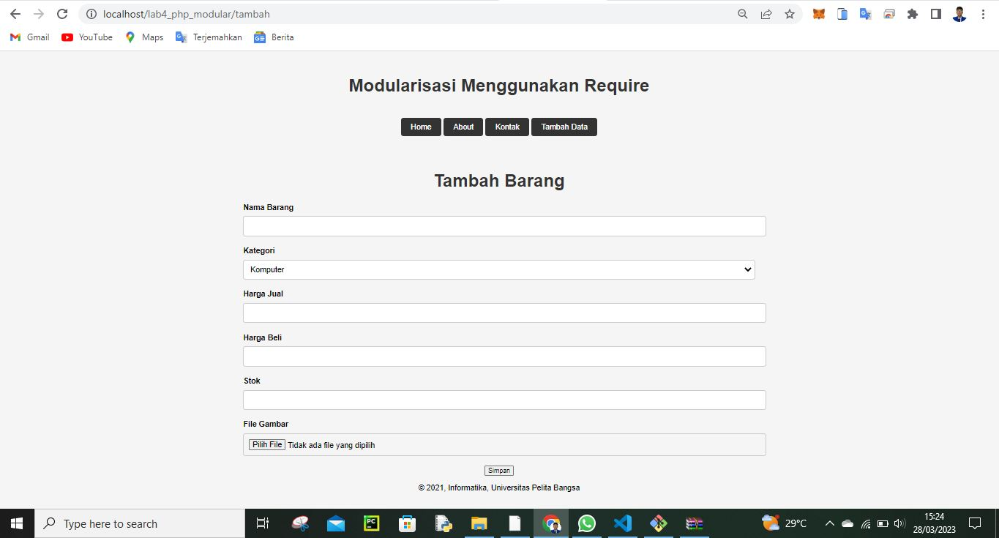

# Lab4Web

<h3>Biodata Mahasiswa</h3>           
    <table>
        <p><tr>
               <td>Kelas</td>
               <td>:</td>
               <td>TI.21.A.1</td>
               <td>&nbsp;</td>
       </tr></p>
       <p><tr>
               <td>Nama</td>
               <td>:</td>
               <td>Ilham Maulana Cakra Dwi Noto</td>
               <td>&nbsp;</td>
       </tr></p>
       <p><tr>
               <td>Nim</td>
               <td>:</td>
               <td>312110027</td>
               <td>&nbsp;</td>
       </tr></p>
       </table>
       

Assalam'mulaikum wr wb. <p> 

Ini adalah tugas praktikum Modulasi dan berikut outputnya<p>

# Tugas_Pratikum_4

Tampilan program di dekstop(komputer)<p>

untuk memanggil halaman di atas kalian harus memasukan url:http://localhost/lab4_php_modular/home<p>

untuk memanggil halaman di atas kalian harus memasukan url:http://localhost/lab4_php_modular/about<p>

untuk memanggil halaman di atas kalian harus memasukan url:http://localhost/lab4_php_modular/kontak<p>

untuk memanggil halaman di atas kalian harus memasukan url:http://localhost/lab4_php_modular/tambah<p>

Berikut penjelasan kenapa urlnya berbentuk :http://localhost/lab4_php_modular/tambah.php tidak pakai .php seperti gambar yang di atas mari aku jelaskan satu satu fungsi koding yang ada di dalam file lab4_php_modular<p>

1. file .htaccess<p>
File .htaccess adalah file konfigurasi yang terletak di direktori situs web dan digunakan untuk mengontrol konfigurasi server Apache yang berhubungan dengan direktori yang sama jadi karna ada file .htaccess lah kita memanggil direktori yang ada di dalam satu file tidak usah pakai .php contoh tambah.php jadi kita bisa memanggil hannya dengan tambah saja. Berikut codingan .htaccess<p>

```php
<IfModule mod_rewrite.c>
 RewriteEngine On
 RewriteBase /lab4_php_modular/
 RewriteCond %{REQUEST_FILENAME} !-f
 RewriteCond %{REQUEST_FILENAME} !-d
 RewriteRule ^(.*)$ index.php?mod=$1 [L]
</IfModule>
```

2. file about.php <p>
adalah suatu file untuk kita bebuat comentar bagi sang pembuat website dibawah ini coding about.php<p>
```php
<?php require('header.php'); ?>
<div class="container">
    <h2>About</h2>
    <div class="box">
        <p>Saya Ilham Maulana Cakra Dwi Noto memperkenalkan diri.</p>
    </div>
</div>
<?php require('footer.php'); ?>
```

3. file footer.php<p>
```php
<head><link href="style.css" rel="stylesheet" type="text/css"></head>
<footer>
    <center><p>&copy; 2021, Informatika, Universitas Pelita Bangsa</p></center>
</footer>
</div>
</body>

</html>
```

singkatnnya, Modulasi di dalam bahasa pemrograman PHP merujuk pada teknik untuk membagi kode menjadi modul atau bagian-bagian yang lebih kecil dan independen yang dapat dipanggil dan digunakan secara terpisah. Modulasi di PHP biasanya dilakukan dengan menggunakan konsep fungsi, kelas, atau namespace. Dengan memodulasi kode, kita dapat membuat kode lebih mudah dipahami, dipelihara, dan diubah di masa depan, serta memungkinkan beberapa pengembang untuk bekerja secara bersamaan pada proyek yang sama dengan mudah. Saya mohon maaf tidak menjelaskan satu persatu file yang ada di dalam folder lab4_php_modulasi di atas tapi kalian bisa membaca penjelasan file yang lain di link ini https://github.com/IlhamMaulanaCakra/lab3_lphp_database.git <p>

Sekian Terima Kasih<p>
