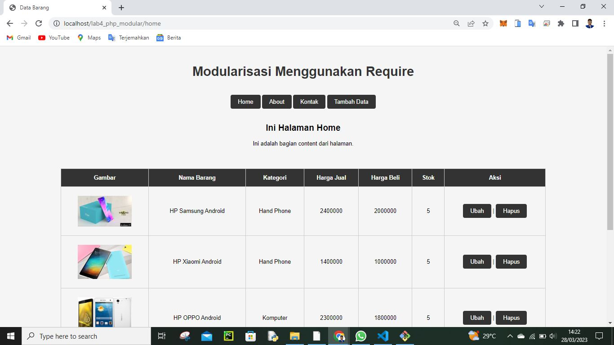

# Lab4Web

<h3>Biodata Mahasiswa</h3>           
    <table>
        
<tr>
               <td>Kelas</td>
               <td>:</td>
               <td>TI.21.A.1</td>
               <td>&nbsp;</td>
       </tr>

       
<tr>
               <td>Nama</td>
               <td>:</td>
               <td>M. AKMAL AL ABDILAH</td>
               <td>&nbsp;</td>
       </tr>

       
<tr>
               <td>Nim</td>
               <td>:</td>
               <td>312110034</td>
               <td>&nbsp;</td>
       </tr>

       </table>

Assalam'mulaikum wr wb. 
 

Di tugas pratikum kali ini saya akan membagikan sedikit shering mengenai program php d  dasar modulasi, tanpa berlama lama lagi saya kan mesering foto hasil outputnya

# Tugas_Pratikum_4

Tampilan program di dekstop(komputer)

untuk memanggil halaman di atas kalian harus memasukan url:http://localhost/lab4_php_modular/home

untuk memanggil halaman di atas kalian harus memasukan url:http://localhost/lab4_php_modular/about

untuk memanggil halaman di atas kalian harus memasukan url:http://localhost/lab4_php_modular/kontak

untuk memanggil halaman di atas kalian harus memasukan url:http://localhost/lab4_php_modular/tambah

dan kenapa urlnya :http://localhost/lab4_php_modular/tambah.php tidak pakai .php seperti gambar yang di atas mari aku jelaskan satu satu fungsi koding yang ada di dalam file lab4_php_modular

1. file .htaccess

File .htaccess adalah file konfigurasi yang terletak di direktori situs web dan digunakan untuk mengontrol konfigurasi server Apache yang berhubungan dengan direktori yang sama jadi karna ada file .htaccess lah kita memanggil direktori yang ada di dalam satu file ga usah pakai .php contoh tambah.php jadi kita bisa memanggil hannya dengn tambah saja dan di bawah ini coding .htaccessny

<IfModule mod_rewrite.c>
 RewriteEngine On
 RewriteBase /lab4_php_modular/
 RewriteCond %{REQUEST_FILENAME} !-f
 RewriteCond %{REQUEST_FILENAME} !-d
 RewriteRule ^(.*)$ index.php?mod=$1 [L]
</IfModule>